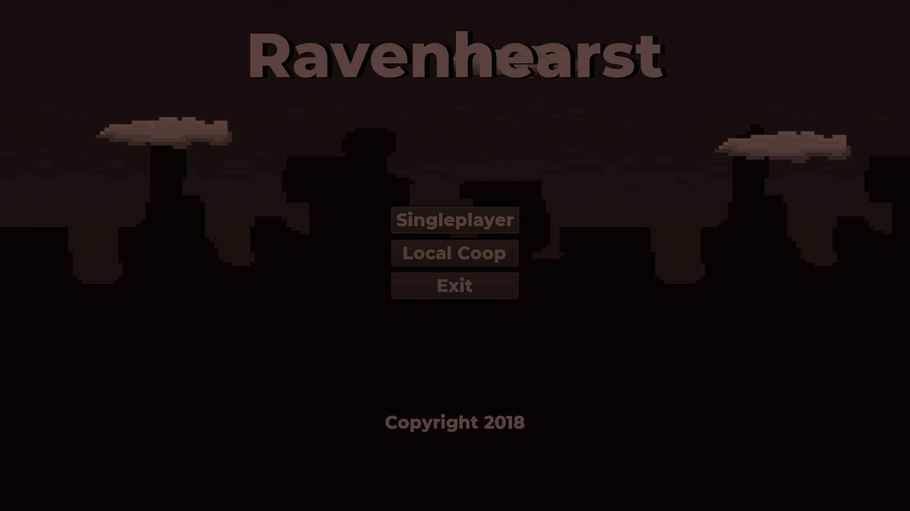
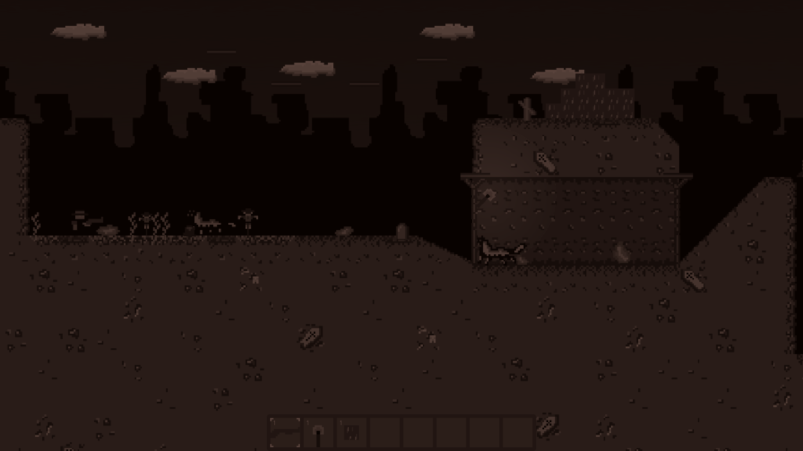
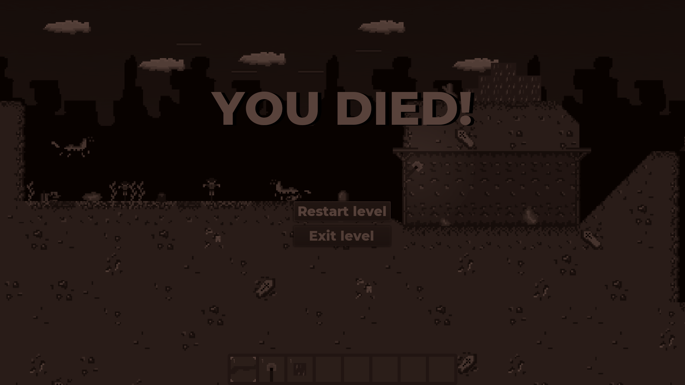

# Ravenhearst
A dusky survival-crafting game in a 2D random generated world. Updated for Godot Engine v3.4.3.





## Controls

```
A/W/D/S: move player
Space: jump/accept
Alt: shoot/use objects
Q/E:switch item from inventory
ESC: main menu/pause game
```
